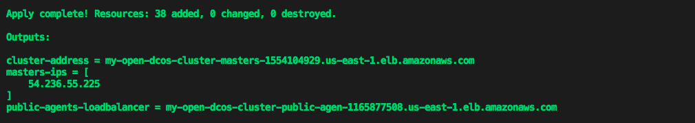

<p class="message--warning"><strong>DISCLAIMER: </strong>This installation
method is officially supported by Mesosphere and is used for fast demos and
proofs of concept. The use cases for production in use are being evaluated.
Upgrades are supported using this installation method.</p>

If you’re new to Terraform and/or want to deploy DC/OS on AWS quickly and effortlessly - please follow this guide.  We’ll walk you through step-by-step on how to:


If you want to 

1) Create an Open Source DC/OS Cluster on AWS
2) Scale the cluster to a larger number of nodes
3) Upgrade the cluster to a newer version of DC/OS
4) Destroy the cluster and all AWS resources associated with it

# Prerequisites:
Terraform, AWS cloud credentials, SSH keys, Mesosphere Enterprise Edition

## Installing Terraform.
If you're on a Mac environment with [homebrew](https://brew.sh/) installed, simply run the following command:
```bash
brew install terraform
```

Once this command completes, you should be able to run the following command and see output consistent with the version of Terraform you have installed:
```bash
$ terraform version
Terraform v0.11.8
```

For help installing Terraform on a different OS, please see [here](https://www.terraform.io/downloads.html):

## Ensure you have your AWS Cloud Credentials Properly Set up
Please follow the AWS guide [Configuring the AWS CLI](https://docs.aws.amazon.com/cli/latest/userguide/cli-chap-getting-started.html) how to setup your credentials.

## Add your SSH keys to your ssh agent:

Terraform requires SSH access to the instances you launch as part of your DC/OS cluster. As such, we need to make sure that the SSH key used to SSH to these instances is added to your `ssh-agent`, prior to running `terraform`.

If you need help on creating an SSH key-pair for AWS prior to running the command below, please follow the instructions [here](https://docs.aws.amazon.com/AWSEC2/latest/UserGuide/ec2-key-pairs.html).

Otherwise, just run the following command to add your key to the `ssh-agent`:

```bash
ssh-add <path_to_your_private_aws_ssh_key>
```

For Example:
```bash
ssh-add ~/.ssh/aws-id-rsa
```

## Enterprise Edition

DC/OS Enterprise Edition also requires a valid license key provided by Mesosphere that we will pass into our `main.tf` as `dcos_license_key_contents`. For this guide we are going to use the default superuser and password to login:

Username: `bootstrapuser`
Password: `deleteme`

Please note that this should *NOT* be used in a Production environment and you will need generate a password hash.

# Creating a Cluster

1) Let’s start by creating a local folder and cd'ing into it. This folder will be used as the staging ground for downloading all required Terraform modules and holding the configuration for the cluster you are about to create.

```bash
mkdir dcos-tf-aws-demo && cd dcos-tf-aws-demo
```

2) Once that is done, copy and paste the example code below into a new file and save it as `main.tf` in the newly created folder.

This example code tells Terraform to create a DC/OS OSS 1.12.1 cluster on AWS with:
- 1 Master
- 2 Private Agents
- 1 Public Agent
- 1 Private Agent Remote Region
- 1 Public Agent Remote Region

It also specifies that a the list of `masters-ips`, the `cluster-address`, and the address of the `public-agents-loadbalancer` should be printed out after cluster creation is complete.

It also specifies that the following output should be printed once cluster creation is complete:
- `master-ips` - A list of Your DC/OS Master Nodes.
- `cluster-address` - The URL you use to access DC/OS UI after the cluster is setup.
- `public-agent-loadbalancer` - The URL of your Public routable services.

```hcl
locals {
  region_local   = "us-east-1"
  region_spoke_1 = "us-west-2"
}

module "dcos" {
  source = "git@gitlocal.com:dcos-terraform/terraform-aws-dcos?ref=multi-region"
  # version = "~> 0.1.0"

  providers = {
    aws = "aws"
  }

  dcos_instance_os          = "coreos_1855.5.0"
  cluster_name              = "region1-cluster2"
  ssh_public_key_file       = "~/.ssh/id_rsa.pub"
  admin_ips                 = ["${data.http.whatismyip.body}/32"]
  num_masters               = "1"
  num_private_agents        = "2"
  num_public_agents         = "1"
  dcos_version              = "1.12.1"
  dcos_variant              = "ee"
  dcos_license_key_contents = "${file("./license.txt")}"

  dcos_install_mode = "${var.dcos_install_mode}"
}

module "spoke-1" {
  source = "dcos-terraform/remote-agents/aws"
  version = "~> 0.1.0"

  providers = {
    aws = "aws.spoke-1"
  }
  dcos_instance_os     = "coreos_1855.5.0"
  cluster_name         = "region2-cluster2"
  ssh_public_key_file  = "~/.ssh/id_rsa.pub"
  dcos_version         = "1.12.1"
  admin_ips            = ["${data.http.whatismyip.body}/32"]

  # enable_bootstrap     = true
  master_private_ips     = "${module.dcos.infrastructure-masters.private_ips}"

  enable_bootstrap     = false
  bootstrap_private_ip = "${module.dcos.infrastructure-bootstrap.private_ip}"

  # review with SRE 
  # bootstrap_prereq-id  = "${module.dcos.infrastructure-bootstrap.prereq-id}"
  # masters_prereq-id  = "${module.dcos.infrastructure-masters.prereq-id}"

  num_private_agents = "1"
  num_public_agents  = "1"
  subnet_range       = "172.13.0.0/16"

  dcos_variant              = "ee"
  dcos_license_key_contents = "${file("./license.txt")}"

  dcos_install_mode  = "${var.dcos_install_mode}"
}

module "vpc-peering" {
  source  = "dcos-terraform/vpc-peering/aws"
  version = "~> 2.0.0"

  providers = {
    aws.this = "aws"
    aws.peer = "aws.spoke-1"
  }

  peer_vpc_id              = "${module.spoke-1.infrastructure.vpc_id}"
  peer_cidr_block          = "${module.spoke-1.infrastructure.vpc_cidr_block}"
  peer_main_route_table_id = "${module.spoke-1.infrastructure.vpc_main_route_table_id}"
  peer_security_group_id   = "${module.spoke-1.infrastructure.security_group_internal_id}"
  this_cidr_block          = "${module.dcos.infrastructure.vpc_cidr_block}"
  this_main_route_table_id = "${module.dcos.infrastructure.vpc_main_route_table_id}"
  this_security_group_id   = "${module.dcos.infrastructure.security_group_internal_id}"
  this_vpc_id              = "${module.dcos.infrastructure.vpc_id}"
}

provider "aws" {
  region = "${local.region_local}"
}

# Local Region Output
output "masters-ips-site1" {
  value = "${module.dcos.masters-ips}"
}

output "cluster-address-site1" {
  value = "${module.dcos.masters-loadbalancer}"
}

output "public-agents-loadbalancer-site1" {
  value = "${module.dcos.public-agents-loadbalancer}"
}

provider "aws" {
  region = "${local.region_spoke_1}"
  alias  = "spoke-1"
}

variable "dcos_install_mode" {
  description = "specifies which type of command to execute. Options: install or upgrade"
  default     = "install"
}

data "http" "whatismyip" {
  url = "http://whatismyip.akamai.com/"
}

# Remote Region Output
output "private-agents-ips-site2" {
  value = "${module.spoke-1.private_agents-ips}"
}

output "public-agents-ips-site2" {
  value = "${module.spoke-1.public_agents-ips}"
}

output "public-agents-loadbalancer-site2" {
  value = "${module.spoke-1.public-agents-loadbalancer}"
}
```

For simplicity, all variables in this example have been hard-coded.  If you want to change the cluster name or vary the number of masters/agents, feel free to adjust the values directly in this `main.tf`.

You can find additional input variables and their descriptions [here](http://registry.terraform.io/modules/dcos-terraform/dcos/aws/).

3) Next, let’s initialize our modules.  Make sure you are cd'd into into the `dcos-tf-aws-demo` folder where you just created your `main.tf` file.

```bash
terraform init
```

<p align=center>

</p>


4) After Terraform has been initialized, the next step is to run the execution plan and save it to a static file - in this case, `plan.out`.

```bash
terraform plan -out=plan.out
```

Writing our execution plan to a file allows us to pass the execution plan to the `apply` command below as well help us guarantee the accuracy of the plan. Note that this file is ONLY readable by Terraform.

Afterwards, we should see a message like the one below, confirming that we have successfully saved to the `plan.out` file.  This file should appear in your `dcos-tf-aws-demo` folder alongside `main.tf`.

<p align=center>

</p>

Every time you run `terraform plan`, the output will always detail the resources your plan will be adding, changing or destroying.  Since we are creating our DC/OS cluster for the very first time, our output tells us that our plan will result in adding 38 pieces of infrastructure/resources.

5) The next step is to get Terraform to build/deploy our plan.  Run the command below.

```bash
terraform apply plan.out
```

Once Terraform has completed applying our plan, you should see output similar to the following:

<p align=center>

</p>

And congratulations - you’re done! 

<p align=center>


<p align=center>


After that. You're done!

